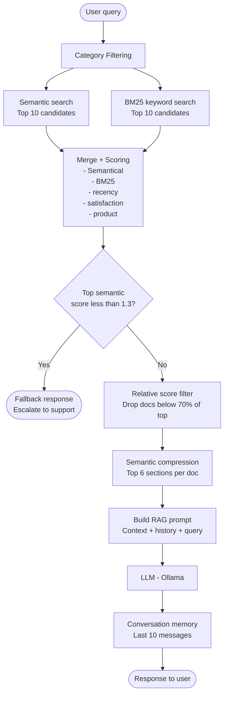
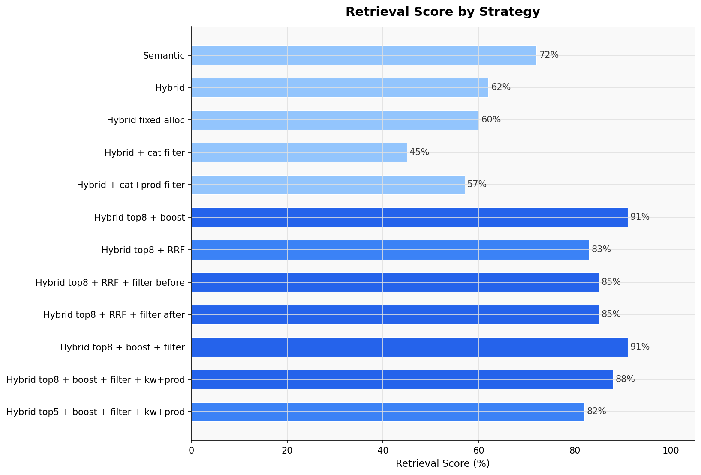
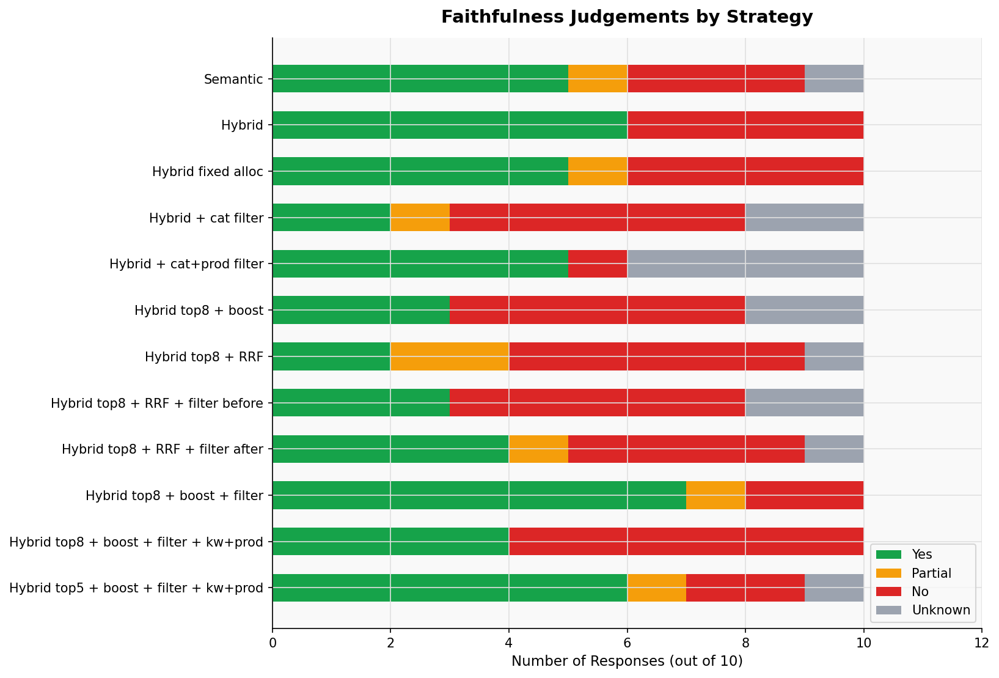
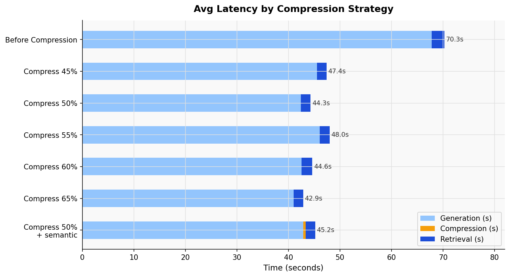
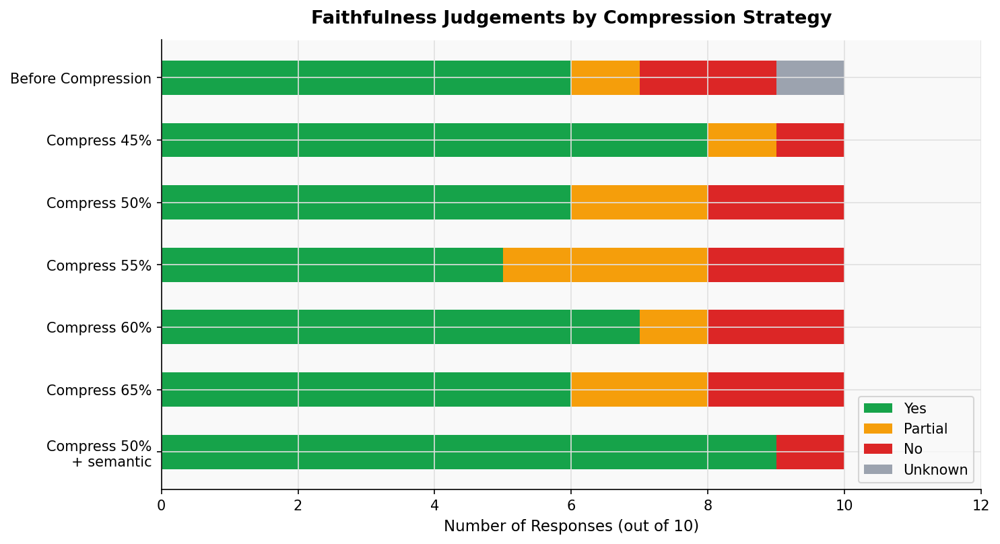
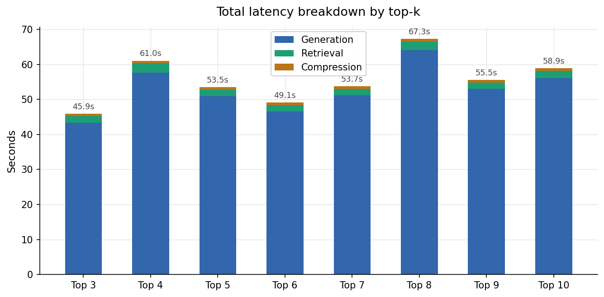
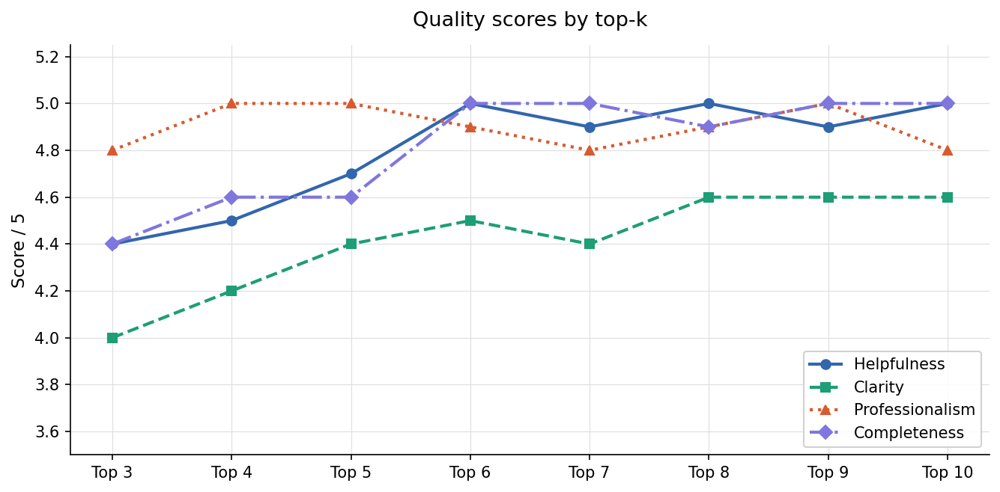
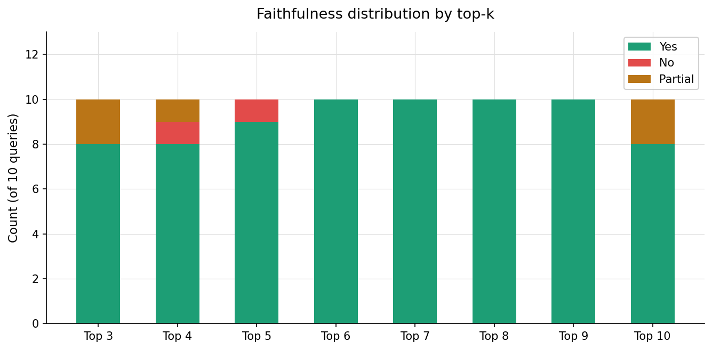
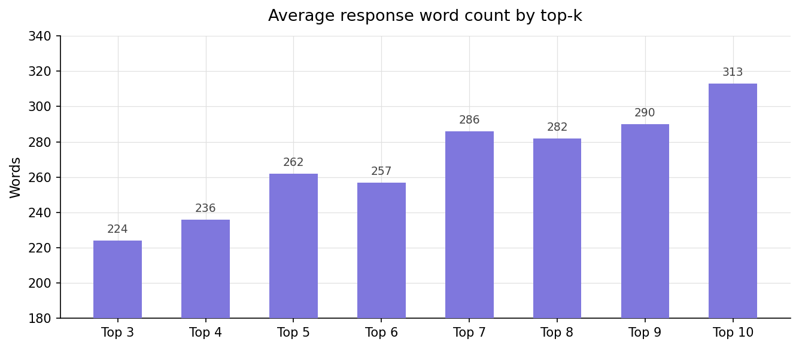

# Omnia Retail Ltd RAG customer support assistant

Name: Renato Francisco Goedert

Student Number: 20099697

Github Repo URL: https://github.com/setu-ibm/ai-assistant-renatogoedert

Youtube (or other) URL: https://www.youtube.com/watch?v=VIGkLNTEVG8

This project Docs is divided in two, [Main Part.md](./README.md) and [Elective Part.md](./elective/README.md) 

----

# Getting Started

Prerequisites:

- Your .env file configured with LLM_PROVIDER and LLM_MODEL 
(The current codebase was just tested with Local models, cloud services wasnt tested)
- Python 3.11+ environment with required libraries
- nomic-embed-text Embedding model

Clone the repository.

```
git clone https://github.com/setu-ibm/ai-assistant-renatogoedert.git
```

Change directory into the project directory and activate the .venv and install the requirements.

```
python -m venv .venv
source .venv/bin/activate
pip install -r requirements.txt
```

Make sure it has the same structure described in Project Structure

To run RAG pipeline

```
python main.py
```

The console will prompt with two options:

- Type 1 for chat
- Type 2 for evaluation

## Project structure

Focusing on the principle of Separation of Concerns (SoC) the project was organized in a layered architecture, also named as N-tier architecture, with each main functionality contained in a respective folder. Nevertheless, this separation improves the code readability and maintainbability, which is valuable in a student project, where each component needs to be cleary understtod and assessed.

<div align="center">

| Layer | Folder | Responsibility |
|:---:|:---:|:---:|
| Entry point | `main.py` | Orchstrator |
| Chat | `chat/` | Chat management |
| Retrieval | `retrieval/` | RAG Retrieval |
| Context | `context/` | Selecting context |
| Evaluation | `evaluation/` | Evaluation strategies |
| Evaluation | `evaluation/` | Chunking strategies |
| Configuration | `config/` | LLM and embeddings setup |
| Docs | `docs/` | Miscellaneous  |
| Docs | `dataset/` | Knowledge base |

</div>

```
ai-assistant/
├── main.py
├── requirements.txt
├── .env
├── chat/
│   └── chat_session.py
├── chunking/
│   └── chunker.py
├── config/
│   └── llm_config.py
├── context/
│   └── context_compressor.py
├── dataset/
│   ├── omnia_retail_knowledge_base.json
│   └── get_categories.py
├── docs/
│   ├── .
│   ├── .
│   └── .
├── evaluation/
│   ├── evaluation_runner.md
│   └── nlp_evaluator.py
└── retrieval/
    └── hybrid_retriever.py
```

## Flow

The pipeline flow starts with the `main.py` entry script, being responsible for creating or loading the vector store with the dataset, initializing the LLM and embedding model, and instantiating the Evaluator. Notably, the system harnesses the fact that Ollama accepts hyperparameter configurations per-request, creating two Python instances: `llm = get_llm()` which utilizes the default temperature of 0.7 for the assistant-generated responses, and `llm_eval = get_llm(temperature=0.1)` setting a lower value to offer more deterministic results for the evaluation pipeline. After all configuration, the script then prompts the user to choose between two modes: chat and evaluation, with both modes following the same flow. However, the evaluation mode receives, as user query, the test cases, prociding to evaluate and print the generated results, while the chat mode continuously receives user input, stores it in a list, if pass fallback verification, and sends the generated responde to the user interface.




# Self Assessment

## Assignment 1a

1. **Conversation Memory: Handle multi-turn conversations where context matters**
   - Completed - [x]
   - Very short writeup on completion: 
      
   For the continuous chat functionality, a straightforward infinite while loop was implemented to continuously receive and process user input, featuring two hardcoded keywords, "quit", to shutdown the pipeline, and "clear", to clear the conversation history. 
   
   ```
   while True:
      query = input("You: ").strip()

      if not query:
            continue
      if query.lower() == "quit":
            print("Goodbye!")
            break
      if query.lower() == "clear":
            self.history.clear()
            print("--- Conversation cleared ---\n")
            continue

   ```

   In regards to the storage of the conversation history, a temporary in-memory list, containing the five most recent user messages and their corresponding assistant responses (10 messages in total), has been employed. This ephemeral and limited strategy helps to reduce irrelevant information being passed to the query and can mitigate hallucinations and save computing resources in LLM responses. Futher development could focus on analising the conversation, ranking and feeding in the RAG system base docs.

   ```
   history_str = "\n".join(
      f"{'Customer' if m['role'] == 'user' else 'Assistant'}: {m['content']}"
      for m in self.history[-10:]
   )

   prompt = self.build_rag_prompt(query, retrieved, history=history_str)
   response = self.llm.invoke(prompt)

   self.history.append({"role": "user", "content": query})
   self.history.append({"role": "assistant", "content": response.content})

   ```

2. **Hybrid Retrieval Strategy: Combine multiple retrieval approaches**
   - Semantic search for similar past issues - [x]
   - Keyword search for exact product names/order numbers - [x]
   - Metadata filtering (recency, category, satisfaction score) - [x]
   - Students must design and justify their hybrid approach: include a blurb on your justification

   The **Hybrid Retriever** is where most of the effort was focused in this assignment, especially because it started being developed before week 7, which contained most of the content for the development of this step. The first retrieval strategy was to sort all docs using per Cosine Similarity, which returned an avarage Recall rate of 72%, a great starting value, close to the 80% set by the student as the minimum acceptable recall rate. Unfortunately, when adding BM25 keyword matching and filters, instead of improving, the recall rate dropped to 45%, which demanded a total restructuring of the system used. After some research, the solution was retrieving the top 8 docs and a boosting strategy, where keyword and semantic scores were combined with satisfaction and recency metadata, with no filtering, this solution raised the recall to 91%.

   |  |  |
   |:---:|:---:|
   | Retrieval Score by Strategy | Faithfulness by Strategy |

   After week 7, the RRF strategy was introduced during the classes, and consequently in this project, an industry strategy to merge Semantic and lexical results. Unexpectedly, using RRF dropped the recall rate to 83%, although, during the evaluation tests, the student was able to identify why the filtering was greatly hurting the recall rate; every type of doc(Policy, FAQ, Ticket) had its own category type, some of them very similar to each other (e.g. "delivery_issue" and "delivery_issues"), to fix that, a simple Python script was developed to retrieve all doc type categories. Therefore, an improved filter was developed taking that into consideration, thereby improving the **Retriever** recall by 2% and dropping latency from 2.7s to 2s.

   
   Regrettably, sending 8 docs to the LLM was reducing faithfulness and generating hallucination, which demanded fewer docs sent to the LLM. The planned solution for this step was to reduce the top 8 to top 5 docs while keeping good recall. To achieve this, the boosting strategy was refined, with the notable changes being: normalizing BM25 and cutting the satisfaction score, which raised the position of policies that were scoring very low semantically. Adding a product booster lowered the recall rate, but positioned the most important documents above the top 5 threshold.

   [Part 2 - Recommend to go the the **Compressor** now]

   To fix the recall rate of the compressor, the results were once again analyzed. The policies seemed to be lower ranked semantically, as they contained too much information for a proper semantic comparison. This was compounded by the fact that the semantic values received a BM25 boost, but the documents retrieved by the BM25 evaluation did not have any semantic value. Therefore, instead of using the distance itself, a new equation was introduced that flattened the semantic scores, combined with minimum semantic value of 0.3, the new strategy brought the recall rate up to 88%.

   ```
   semantic_scores = {
      doc.metadata.get("document_id", ""): round(1 / (1 + distance), 3)
      for doc, distance in semantic_with_scores
   }
   semantic = [doc for doc, _ in semantic_with_scores]
   ```

   ```
   for rank, doc in enumerate(candidates):
      doc_id = doc.metadata.get("document_id", "")
      raw_doc = self.doc_lookup.get(doc_id, {})

      sem_score  = semantic_scores.get(doc_id, 0.3)
      kw_boost   = self._bm25_boost(query, doc_id)
      rec_boost  = self._recency_boost(raw_doc)
      sat_boost  = self._satisfaction_boost(raw_doc)
      prod_boost = self._product_boost(raw_doc, product)
   ```

   ```
   === Evaluation Summary ===
    Total queries       : 10
    Avg retrieval score : 88%
    Faithfulness        : {'YES': 10, 'NO': 0, 'PARTIAL': 0, 'UNKNOWN': 0}
    Avg retrieval time  : 2.55s
    Avg compression time: 0.826s
    Avg generation time : 53.207s
    Avg total latency   : 56.584s
    Avg response words  : 208
   ```

   All results can be found in [evaluation_results_retrieval.md](./docs/evaluation_results_retrieval.md), [restructured_retriever_results.md](./docs/restructured_retriever_results.md)


3. **Dynamic Context Selection: Intelligently choose how much context to include**
   - Not all retrieved documents are equally relevant
   - Must implement re-ranking or relevance scoring - [x]
   - Balance between context quality and token limits: include a blurb on the tradeoffs

   Where the main metric for the retriever was the recall rate, the **Compressor** would focus mainly on reducing latency and increasing the faithfulness. For that porpouse and leveraging the knowledge obtained on previous steps, the **Compressor** would have two main optimization vectors. First, a filter drawing upon the multi-signal score of the retriever, that drops any document falling below a specific percentage of the highest-ranked document's score. Following empirical testing, a threshold value of 50% was determined to yield the best performance.

   |  |  |
   |:---:|:---:|
   | Latency by Strategy | Faithfulness by Strategy |

   The second optimization involves segmenting the large documents retrieved by the retriever into smaller chunks, ensuring that only the most relevant text segments are forwarded to the LLM. Analysis of the dataset revealed that paragraph-level segmentation was the most compatible chunking strategy, as the underlying documents are well-structured using standard newline characters (\n). To determine chunk priority, the system evaluated both semantic and lexical scoring strategies.

   ```
   Avg retrieval time  : 1.862s
   Avg Lexical compression time: 0.001s
   Avg Semantic compression time: 0.455s
   Avg generation time : 42.876s
   Avg total latency   : 44.738s
   ```

   Semantic evaluation yielded superior results but introduced greater computational overhead, requiring 455ms compared to the negligible 1ms required by the lexical approach. However, because the system experiences a total generation latency of nearly 43 seconds, primarily constrained by the student hardware, this semantic processing overhead accounts for less than 1% of the total execution time. Given this minimal performance impact, the semantic sorting strategy was selected as the optimal choice to pass the top-K highest-scoring chunks to the LLM.
   
   ```
   === Evaluation Summary ===
   Total queries       : 10
   Avg retrieval score : 78%
   Faithfulness        : {'YES': 9, 'NO': 1, 'PARTIAL': 0, 'UNKNOWN': 0}
   Avg retrieval time  : 1.862s
   Avg Lexical compression time: 0.001s
   Avg Semantic compression time: 0.455s
   Avg generation time : 42.876s
   Avg total latency   : 44.738s
   Avg response words  : 225
   ```

   The results of the compressor dropped the recall rate to 78% but kept the faithfulness to an acceptable score, with 9 "Yes" responses. Aiming to fix this issue, the retriever code was inspected.

   [Part 2- Recommend going back to Retriever part 2]

   After the recall rate was raised to an acceptable threshold, more testing was conducted to determine the optimal Top-K chunk distribution, as illustrated in the performance charts below. Helpfulness, Clarity, and Completeness exhibited steady improvement up to a Top-6 threshold before reaching a plateau. Professionalism remained largely stable (4.8 to 5), showing only a marginal decrease between the Top-6 and Top-8 intervals.
   
   Notably, the Faithfulness score climbed consistently from Top-3 to Top-6; achieving an absolute score of 10 "Yes" responses, before degrading to 8 "Yes" responses at Top-10. This performance drop indicates that the inclusion of excessive context introduces informational noise, which elevates the risk of model hallucinations. While the recorded processing times contained distinct outliers potentially attributable to local hardware constraints, these anomalies persisted across multiple validation runs.
   
   Based on this, a Top-6 configuration was selected as the optimal deployment threshold.

   |  |  |
   |:---:|:---:|
   | Latency by TopK | Quality by TopK |
   |  |  |
   | Faithfulness by TopK | Word Count by TopK |

   All results can be found in [evaluation_results_compressor.md](./docs/evaluation_results_compressor.md), [evaluation_results_compressor_topk.md](./docs/evaluation_results_compressor_topk.md)

4. **Fallback Handling: Gracefully handle cases where RAG doesn't help**
   - Detect when no relevant information exists - [x]
   - Provide helpful fallback responses - [x]
   - Flag for human escalation with reasoning - [x]

   As computational tractability remains one of the main constraints in the application of any AI system, the **Fallback Fandling System** was designed to be simple, fast and capitalising on the established codebase, further adhering to the DRY (Don't Repeat Yourself) principle. As a result, the implemented strategy consists of a efficient and deterministic function that triggers if the multi-signal evaluation fails to yield the retrieved documents a score of 1.2 or above, a value established through testing. When activated, it stops the query from reaching the LLM generation stage (the most demanding stage of this system) and replies with a message allowing for human escalation. Futhermore, the query is ommited from the conversation story, reducing the noise and risk for hallucination. 

   ```
   top_score = results[0][1] if results else 0
   if top_score < 1.2:
      self.debug and print(f"  [Retriever] Low confidence — top score={top_score} below threshold")
      return []
   ```

   Although this function operates as a basic conditional check, it does not merely evaluate a superficial number; it relies entirely on the retriever’s complex, multi-signal scoring strategy. This underlying architecture synthesizes semantic similarity, BM25 scoring, product relevance, client satisfaction, and recency into a single aggregated value.

   ```
   if not retrieved:
      print("\nAssistant: I couldn't find any relevant information for your query. "
         "Please try rephrasing your question or contact our support team directly at support@omniaretail.ie.")
      continue
   ```

   In addition for the programmatic guardrail, the system prompt contains instructions to forbid the LLM from engage in off-topic conversations, allied with the limited and temporary message storage to limit curb adversarial manipulation. However, the current archtecture lacks dedicated and robust guardrails, meaning that the fallback could potentially be bypassed by a sophisticated actor.

   ```
   If the documentation doesn't contain enough information, say so clearly.
   Do not partake in any conversation that is not related to the store
   ```

   A potential system enhancement involved integrating an LLM fallback call to classify the query and escalate it to the appropriate department or person. However, given the generation latency and computational costs, coupled with the fact that most undocumented queries can easily be routed by a simple deterministic function, adopting an LLM alternative offered no real benefit for the amount of resources consumed. Furthermore, this type of escalation introduces no novel structural concepts unless it incorporates guardrails or autonomous agent actions, both of which are outside the scope of this report.