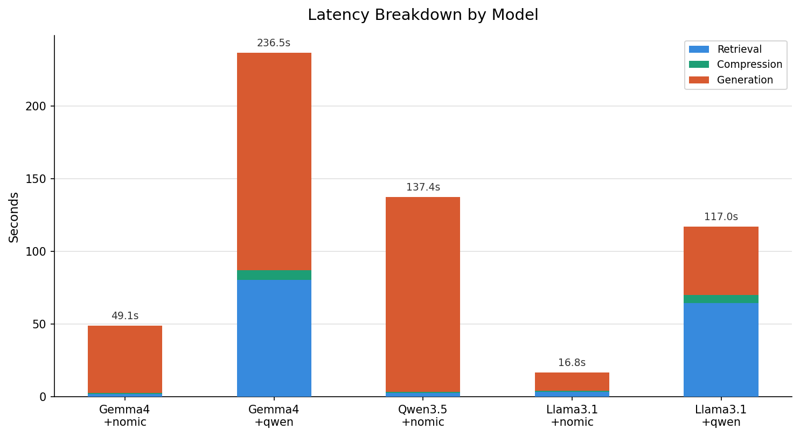
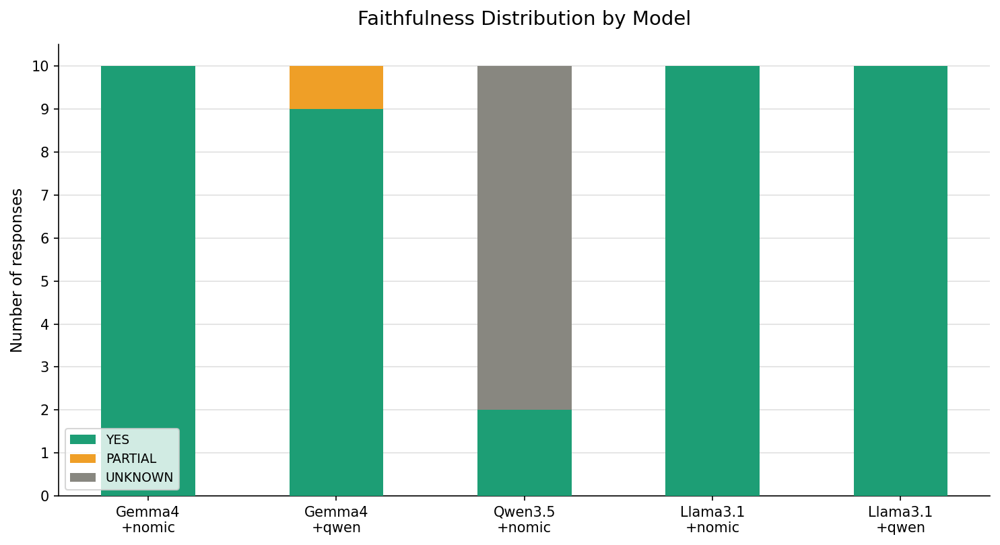
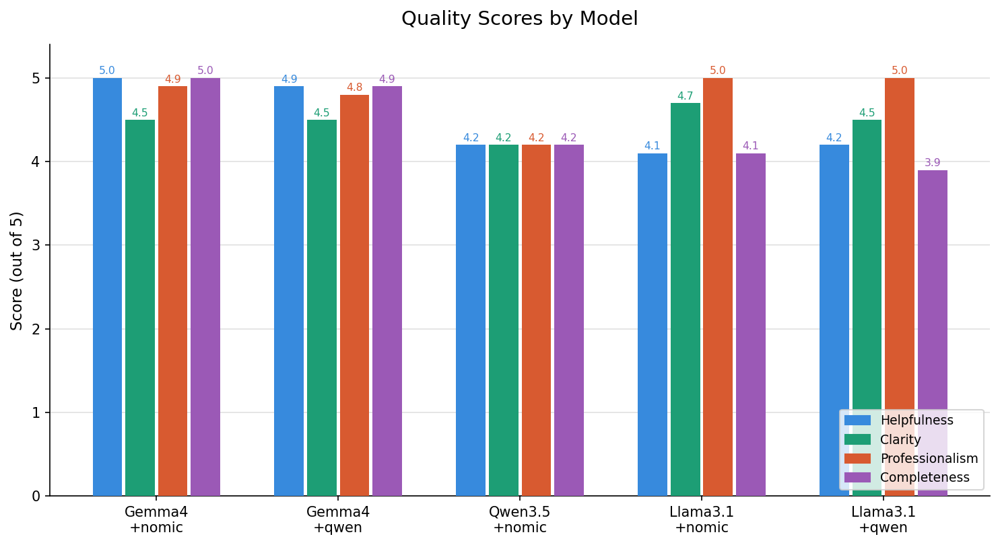
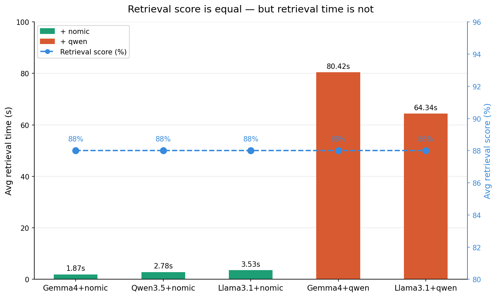
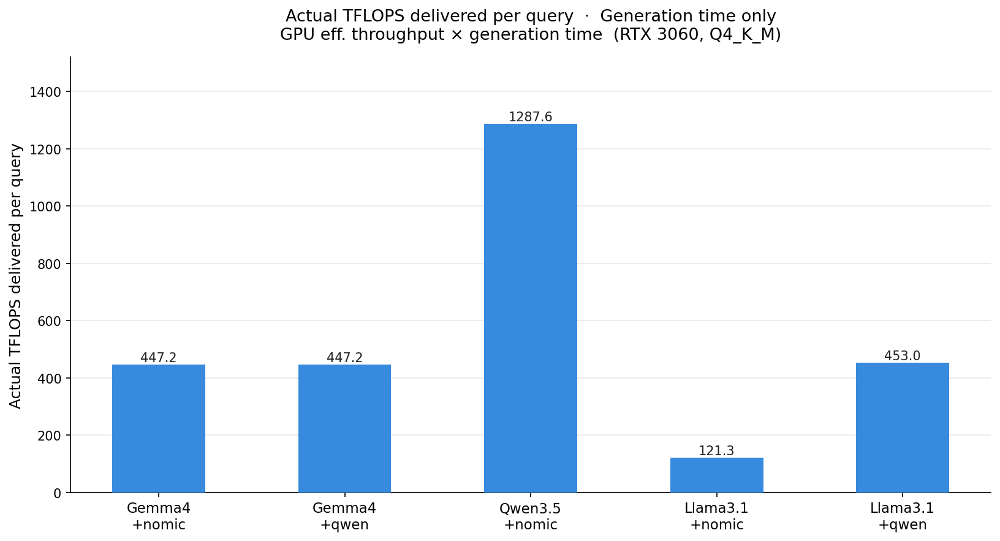
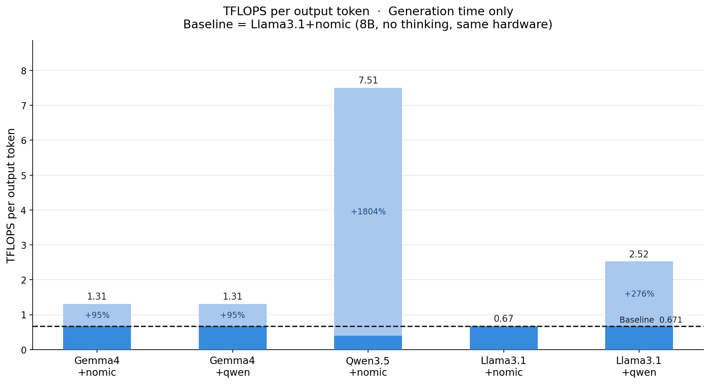

# A/B Testing with Business Metrics

Name: Renato Francisco Goedert

Student Number: 20099697

Github Repo URL: https://github.com/setu-ibm/ai-assistant-renatogoedert

Youtube (or other) URL: https://www.youtube.com/watch?v=VIGkLNTEVG8

This project Docs is divided in two, [Main Part.md](../README.md) and [Elective Part.md](../elective/README.md) 

# Elective

Please select one elective, this can only be completed once 1a is completed to the level you have aimed for:

1. **Cost-Performance Optimisation: Minimise costs while maintaining quality**
   - Compare local (Ollama) vs cloud (OpenAI) for different query types
   - Implement routing logic: simple queries → local, complex → cloud
   - Document cost-quality trade-offs with data

2. **Business Metrics Dashboard: Track real support metrics**
   - First response time (latency)
   - Resolution accuracy (using test set)
   - Customer satisfaction proxy (using LLM-as-judge)
   - Cost per interaction
   - Escalation rate (% queries needing human)

3. **A/B Testing Report: Compare at least 2 system configurations**
   - Different prompt strategies OR
   - Different retrieval parameters OR
   - Different embedding models
   - Present findings with statistical significance

4. **Edge Case Documentation: Identify and document 10+ failure modes**
   - What types of queries fail?
   - Why does the system struggle?
   - Proposed improvements

## Self Assessment

This section focus on item 2 and 3. 

The A/B testing evaluated three LLMs and two text embedding models. It measured first response time (latency), resolution accuracy (using a test set), and customer satisfaction metrics (using LLM-as-a-judge). Additionally, a Floating Point Operations (FLOPs) computational cost analysis was performed to quantify the cost per interaction.

### Comparing LLM and Embeddings Models

The A/B testing evaluated three LLMs (llama3.1:8b, gemma4:e4b, and qwen3.5:4b) against two embedding models: nomic-embed-text and qwen3-embedding. While mxbai-embed-large was originally considered, its strict 512-token context window proved incompatible with the vector store architecture and, consequently, was excluded from testing.

|  |
|:---:|
| Latency per LLM + Embbeding |

During the tests, the latency showed unexpected results; the 8B parameter Llama model consistently outperformed both smaller 4B parameter models in generation speed, a trend which persisted across multiple validation runs. Investigating this divergence revealed that, unlike the 4B models, Llama 3.1 does not utilize reasoning during inference, which significantly accelerated iteration speed. This statistical finding highlights that model selection depends on specific system requirements and pertinent testing, rather than parameter count alone.

| |  |
|:---:|:---:|
|Faithfulness per LLM + Embbeding | Quality per LLM + Embbeding |

Despite the additional processing overhead introduced by the reasoning-focused models, there was no measurable improvement in response quality or faithfulness.

|  |
|:---:|
| Retrieval time x score per LLM + Embbeding |

In regard to the embedding layers, the more complex Qwen embedding model yielded no significant improvement in retrieval scores when compared to Nomic, while introducing substantial latency. This second anomaly highlights the efficacy of the existing multi-signal boosting strategy, which compensates for lighter embedding architectures. Moreover, the combination of Qwen 3.5 and Qwen Embedding was omitted from testing, as it projected an excessive execution time on the available hardware while offering no novel data points beyond the trends already established by alternative runs.

### Cost per interaction

To determine the cost per interaction, this analysis utilizes real-world hardware profiling rather than theoretical calculations. LLM generation intervals were measured against GPU utilization. Consequently, the cost was calculated by multiplying the GPU FLOPs output by the total execution time, yielding the total FLOPs consumed per LLM+embedding configuration.

| |  |
|:---:|:---:|
|FLOPs per query | FLOPs per output Token |

The data shows that reasoning models consume significantly higher FLOPs per token without delivering a proportional increase in qualitative scores. This outcome reinforces the necessity of empirical hardware testing over theoretical estimation when evaluating system efficiency.

Additionally, combining Llama 3.1 with the Qwen embedding model resulted in increased latency when compared with Nomic, whereas the Gemma configuration maintained consistent FLOP consumption. Further investigation raised the possibility that this variance occurs because the Qwen embedding model utilizes GPU resources concurrently with the LLM. A possible architectural optimization of Gemma could have accommodated this shared workload more efficiently, whereas the Llama pipeline suffered a significant performance penalty under co-allocated embedding execution.