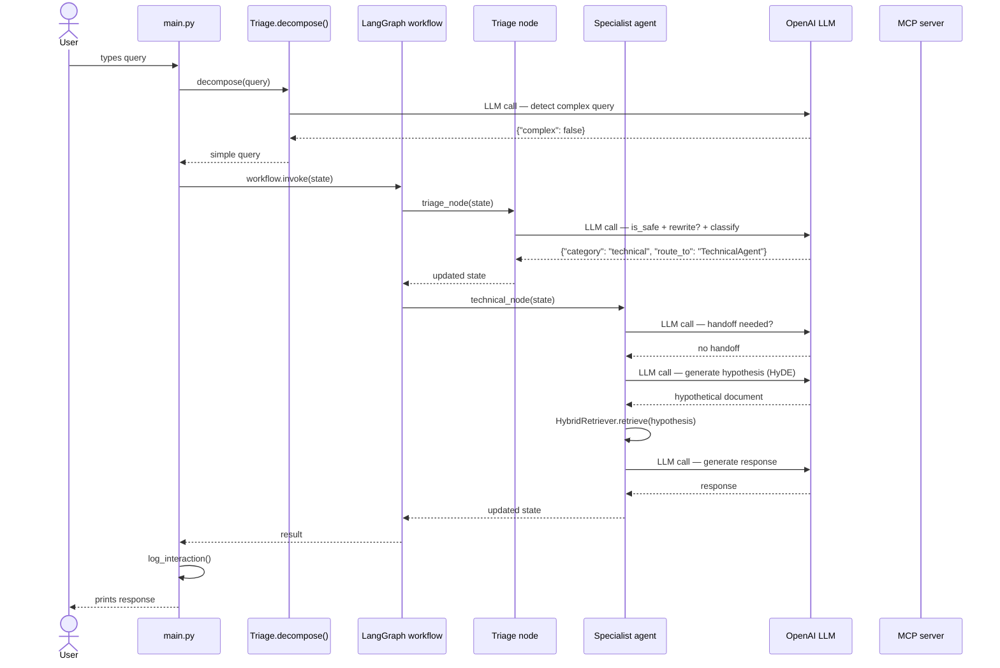
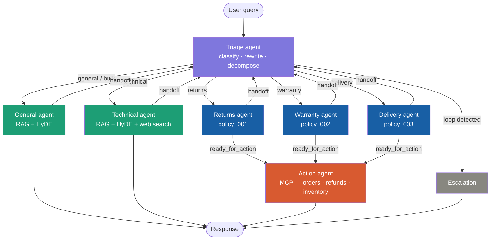

# building-ai-assignment-02-starter

* TODO: Check of completed boxes with an x like this - [x]
* TODO: Clone this repo - [x]
* TODO: Change Title in Readme - []
* TODO: Fill out the information below - []

Name: Please Enter Name

Student Number: Please Enter Student Number

Github Repo URL:  Please provide the github repo URL for THIS repo as sometimes github usernames can get mixed up and you will be zipping this directory to go up to moodle. 

----

# Getting Started

Requirements: You MUST use a .venv and a requirements.txt

TODO: How to get going, run and interact - []

This section should be followable by someone cloning your repo for the first time, marks will be lost for omitted instructions.

# Self Assessment

TODO: X the boxes you completed and include BRIEF clarification where asked - []

## Assignment 2a

1. **Specialised Agent Architecture: Build at least 3 specialised agents** 
   - Triage Agent: Classify urgency, route to appropriate handler - []
   - Information Agent: Uses advanced RAG with query decomposition - []
   - Action Agent: Executes operations via tool calling - []
   - Agents must communicate and coordinate - []

2. **Query Decomposition & Multi-Step Reasoning: Handle complex requests** 
   - Must break down into sub-problems - []
   - Execute multiple retrieval operations - []
   - Synthesise comprehensive response - []

3. **Tool Integration: Connect to simulated backend systems (you'll provide mock APIs)**
   - At least 1 API connected - []
   - MCP used - []

4. **Advanced Retrieval Strategies: Implement at least 2 advanced techniques**
   - Query expansion/rewriting - []
   - Hypothetical document embeddings (HyDE) - []
   - Parent-child document chunking - []
   - Temporal/metadata boosting - []
   - Students choose and justify their approaches - []

