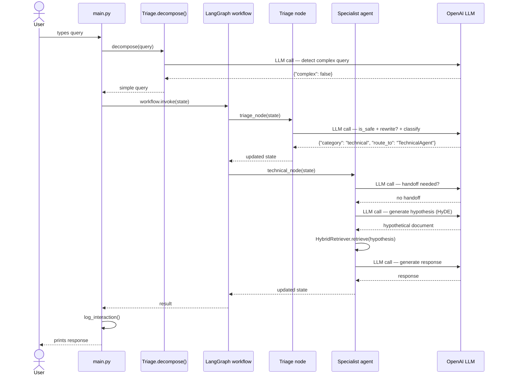
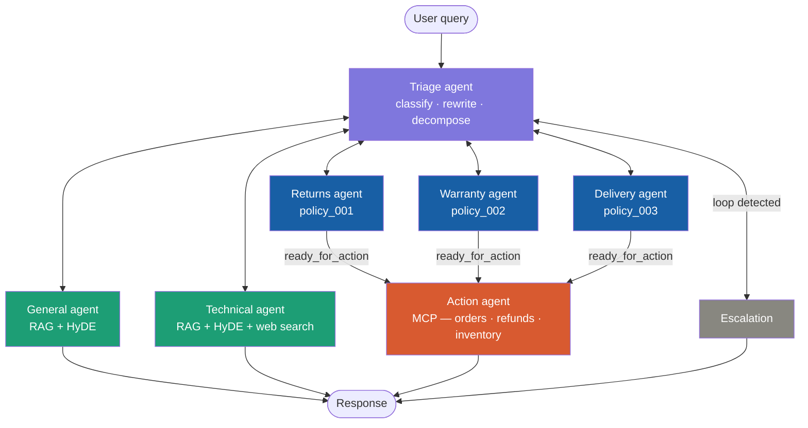

# building-ai-assignment-02-starter

* TODO: Check of completed boxes with an x like this - [x]
* TODO: Clone this repo - [x]
* TODO: Change Title in Readme - []
* TODO: Fill out the information below - []

Name: Please Enter Name

Student Number: Please Enter Student Number

Github Repo URL:  Please provide the github repo URL for THIS repo as sometimes github usernames can get mixed up and you will be zipping this directory to go up to moodle. 

----

# Getting Started

Prerequisites:

- Your .env file configured with EMBEDDINGS_PROVIDER, EMBEDDINGS_MODEL, and OPENAI_API_KEY 
(The current codebase need the OpenAI API)
- Python 3.11+ environment with required libraries

Clone the repository.

```
git clone https://github.com/setu-ibm/agentic-assistant-renatogoedert.git
```

Change directory into the project directory and activate the .venv and install the requirements.

```
python -m venv .venv
source .venv/bin/activate
pip install -r requirements.txt
```

Make sure it has the same structure described in Project Structure

Start The MCP server (Terminal 1)

```
python -m mock_data.mcp_server
```

Start the Chatbot (Terminal 2)

```
python main.py
```

Login

- Any `name` + password `123456`
- Login as `admin` for debug mode (shows routing decisions, tool calls, retrieved docs)

## Project structure

Focusing on the principle of Separation of Concerns (SoC) the project was organized in a layered architecture, also named as N-tier architecture, with each main functionality contained in a respective folder. Nevertheless, this separation improves the code readability and maintainbability, which is valuable in a student project, where each component needs to be cleary understtod and assessed.

<div align="center">

| Layer | Folder | Responsibility |
|:---:|:---:|:---:|
| Entry point | `main.py` | Orchstrator |
| Agents | `agent/` | Agents management |
| Config | `config/` | LLM calls managment |
| Logs | `logs/` | Storing Chatbot logs |
| Memory | `memory/` | Storing conversations |
| Mock Data | `mock_data/` | Mock API and MCP |
| RAG | `rag/` | RAG |
| ConfTest | `conftest.py` | script to manage path |

</div>

```
agentic-assistant/
├── main.py                          ← entry point, login, chat loop
├── mock_data/
│   ├── mcp_server.py                ← FastMCP server
│   ├── mock_api.py                  ← mock backend functions
│   └── omnia_backend.json           ← mock database
├── agents/
│   ├── workflow.py                  ← LangGraph StateGraph
│   ├── tools/
│   │   ├── safety.py                ← is_safe @tool
│   │   └── handoff.py               ← handoff @tool + check_for_handoff
│   ├── triage/
│   │   ├── triage_agent.py          ← TriageAgent + decompose()
│   │   ├── tool_classifier.py       ← classify_query @tool
│   │   └── tool_rewriter.py         ← rewrite_query @tool
│   ├── general/
│   │   └── general_info_agent.py    ← GeneralAgent + HyDE
│   ├── technical/
│   │   └── technical_agent.py       ← TechnicalAgent + HyDE + web search
│   ├── action/
│   │   └── action_agent.py          ← ActionAgent + MCP tools
│   ├── returns/
│   │   └── returns_agent.py         ← ReturnsAgent + policy_001
│   ├── warranty/
│   │   └── warranty_agent.py        ← WarrantyAgent + policy_002
│   └── delivery/
│       └── delivery_agent.py        ← DeliveryAgent + policy_003
├── rag/                             ← Assignment 1 RAG pipeline
├── memory/                          ← per-user JSON memory files
└── logs/                            ← per-user interaction logs
```

## Flow



# Self Assessment

TODO: X the boxes you completed and include BRIEF clarification where asked - []

## Assignment 2a

1. **Specialised Agent Architecture: Build at least 3 specialised agents** 
   - Triage Agent: Classify urgency, route to appropriate handler - [x]
   - Information Agent: Uses advanced RAG with query decomposition - [x]
   - Action Agent: Executes operations via tool calling - [x]
   - Agents must communicate and coordinate - [x]



2. **Query Decomposition & Multi-Step Reasoning: Handle complex requests** 
   - Must break down into sub-problems - [x]
   - Execute multiple retrieval operations - [x]
   - Synthesise comprehensive response - [~]

        - [Triage Agent](./agents/triage/triage_agent.py)
        ```
        class TriageAgent:

            .
            .
            .

            def decompose(self, query: str) -> dict:

                """
                Check if query is complex and decompose into sub-queries.
                Returns {"complex": bool, "sub_queries": list}.
                """
                
                prompt = f"{DECOMPOSE_PROMPT}\n\nInput: {query}\nOutput:"
                response = self.llm.invoke(prompt)
        
                try:
                    json_match = re.search(r'\{.*\}', response.content, re.DOTALL)
                    if json_match:
                        result = json.loads(json_match.group())
                        # Add route_to to each sub-query
                        for sq in result.get("sub_queries", []):
                            sq["route_to"] = ROUTING.get(sq.get("category"), "GeneralAgent")
                        return result
                except Exception:
                    pass
        
                return {"complex": False, "sub_queries": []}
        ```

        - [Main](./main.py)

        ```
            while True:
                # Check for pending sub-queries
                if memory.get("awaiting_next_issue"):
                    query = input("You: ").strip()
                    if query.lower() in ("yes", "y", "sure", "ok", "okay", "yeah"):
                        next_sq = memory["pending_queries"].pop(0)
                        memory["awaiting_next_issue"] = False
                        memory["current_agent"] = ""
                        query = next_sq["query"]
                        debug and print(f"  [Decomposer] Starting next issue: {query}")
                    else:
                        memory["awaiting_next_issue"] = False
                        memory["pending_queries"] = []
                else:
                    query = input("You: ").strip()

                    .
                    .
                    .

                    # Decompose 
                    if not memory.get("current_agent"):
                        decomp = triage.decompose(query)
                        if decomp.get("complex") and len(decomp.get("sub_queries", [])) > 1:
                            sub_queries = decomp["sub_queries"]
                            if debug:
                                print(f"  [Decomposer] Complex query — {len(sub_queries)} issues detected:")
                                for sq in sub_queries:
                                    print(f"    - {sq['query']} (category: {sq['category']})")

                            memory["pending_queries"] = sub_queries[1:]
                            query = sub_queries[0]["query"]
                            memory["current_agent"] = ""

                # Run workflow 
                response, result = _process_query(query, name, history_str, debug, memory, workflow)
                memory["current_agent"] = result.get("current_agent", "")

                if memory["pending_queries"]:
                    next_issue = memory["pending_queries"][0]["query"]
                    response += f"\n\nI also noticed you mentioned another issue: \"{next_issue}\". Would you like me to help with that now?"
                    memory["awaiting_next_issue"] = True
        ```

3. **Tool Integration: Connect to simulated backend systems (you'll provide mock APIs)**
   - At least 1 API connected - [x]
   - MCP used - [x]

        - [Mock mcp](./mock_data/mcp_server.py)
        - [Mock api](./mock_data/mock_api.py)
        - [Action Agent](./agents/action/action_agent.py)

4. **Advanced Retrieval Strategies: Implement at least 2 advanced techniques**
   - Query expansion/rewriting - [x]
        - [Rewriter tool](./agents/triage/tool_rewriter.py)
        - [Triage Agent](./agents/triage/triage_agent.py)
        ```
        # Check rewrite_query
        rewritten_query = None
        for msg in result["messages"]:
            if hasattr(msg, "type") and msg.type == "tool" and "rewritten" in str(msg.content):
                match = re.search(r'\{.*\}', msg.content, re.DOTALL)
                if match:
                    parsed = json.loads(match.group())
                    rewritten_query = parsed.get("rewritten")
        ```

   - Hypothetical document embeddings (HyDE) - [x]
        - [Technical Agent](./agents/technical/technical_agent.py)
        ```
        class TechnicalAgent:
        .
        .
        .
            def _generate_hypothesis(self, query: str) -> str:

                """
                Generate a hypothetical document to improve RAG retrieval (HyDE technique).
                Based on: Gao et al. (2023)
                """
                prompt = f"""
                    You are generating a hypothetical document for Omnia Retail Ltd, an Irish electronics retailer.
                    The knowledge base contains: policies, FAQs, and support tickets.
                    
                    Write a short hypothetical document (under 100 words) that would answer this query.
                    Write it as a document excerpt, not as a response to a customer.
                    It may contain inaccuracies — focus on using the right structure and vocabulary.
                    
                    Query: {query}
                    
                    Hypothetical document:
                """
                response = self.hyde_llm.invoke(prompt)
                return response.content.strip()
        .
        .
        .
        def process(self, query: str, history: str = "", debug: bool = False) -> dict:
            .
            .
            .
                # HyDE
                hypothesis = self._generate_hypothesis(query)
                retrieved = self.retriever.retrieve(hypothesis)
                compressed = self.compressor.compress(query, retrieved) if retrieved else []
                rag_context = "\n\n".join([doc.page_content for doc in compressed]) if compressed else ""
        ```
        - [General Agent](./agents/general/general_info_agent.py)
        ```
        class GeneralAgent:
        .
        .
        .
            def _generate_hypothesis(self, query: str) -> str:

                """
                Generate a hypothetical document to improve RAG retrieval (HyDE technique).
                Based on: Gao et al. (2023)
                """
                prompt = f"""
                    You are generating a hypothetical document for Omnia Retail Ltd, an Irish electronics retailer.
                    The knowledge base contains: policies, FAQs, and support tickets.
                    
                    Write a short hypothetical document (under 100 words) that would answer this query.
                    Write it as a document excerpt, not as a response to a customer.
                    It may contain inaccuracies — focus on using the right structure and vocabulary.
                    
                    Query: {query}
                    
                    Hypothetical document:
                """
                response = self.hyde_llm.invoke(prompt)
                return response.content.strip()
        .
        .
        .
            def process(self, query: str, history: str = "", debug: bool = False) -> dict:
            .
            .
            .
                # RAG 
                retrieved = self.retriever.retrieve(query)
                top_score = float(retrieved[0].metadata.get("retrieval_score", 0)) if retrieved else 0.0
        
                # HyDE 
                if not retrieved or top_score < 1.5:
                    hypothesis = self._generate_hypothesis(query)
                    debug and print(f"  [GeneralAgent] HyDE triggered (score={top_score:.2f}) → {hypothesis[:80]}...")
                    hyde_retrieved = self.retriever.retrieve(hypothesis)
                    if hyde_retrieved:
                        retrieved = hyde_retrieved

    ```
   - Parent-child document chunking - []
   - Temporal/metadata boosting - []
   - Students choose and justify their approaches - []


